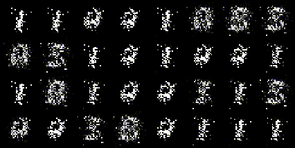
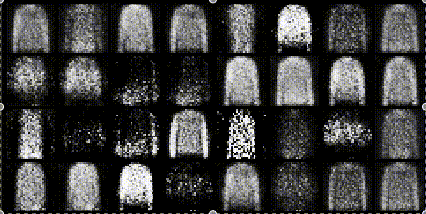
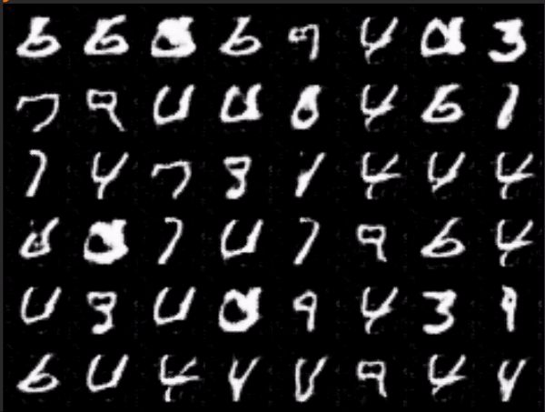
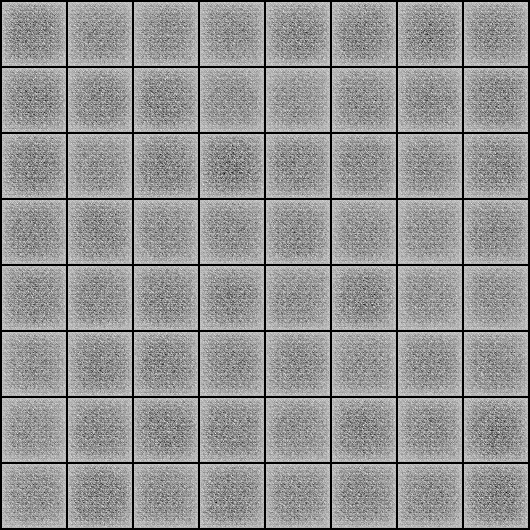
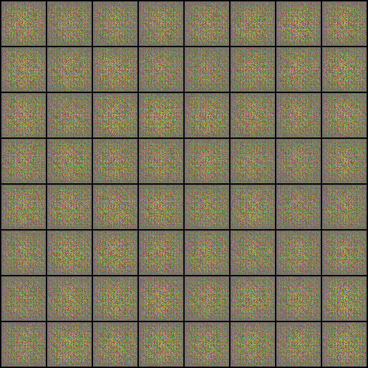
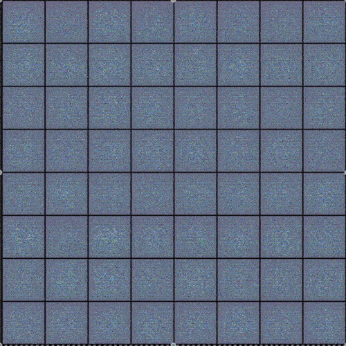

<div align="center">

# The Ultimate GAN


<br>
</br>

</div>

---

1. [Overview](#overview)
2. [**Installation** `🛠️`](#how-to-install-the-package)
3. [**Usage**](#usage)

## Overview

This library focuses on different variants of the Generative Adversarial Networks. This library was created as a
learning initiative to learn everything there is about GANs. The goal of this library is to provide all types of GANs
under one hood and let anyone explore, train and learn about them with just one command. I will also try to write a blog
on medium regarding each one of the GANs mentioned in this library.

## How to install the package

To install this package to use the cli-tool, first clone the package. Run the following commands:

```bash
git clone https://github.com/Zohaibb-m/the-ultimate-GAN.git
cd the-ultimate-GAN
pip install -e .
```

This will install the package in editable mode so you can always pull the latest changes, and they will work with the
cli-tool.

## Usage

You can train various types of GANs using this module. You can also change any layer for any model, and it will work
like a charm.
To use this library you can use the cli-tool available which will automatically take care of all dependencies. Then see
all available commands using:

```bash
tugan --help
```

Example:

```bash
tugan train --model-name s-gan --dataset fashion-mnist --learning-rate 0.0003
```

More options are available and can be viewed using

```bash
tugan train --help
```

To start a tensorboard session run:

```bash
tensorboard --logdir ./runs
```

<hr>

## Implementations

### Simple GAN

#### Explanation:

The medium article explaining Simple GAN is available with the same code explanation
at <kbd>[Building a Simple GAN](https://medium.com/@zohaibmunir32/generative-adversarial-networks-part-1-an-introduction-and-implementation-of-the-simplest-form-6b8973df38fd)</kbd>

#### Training

Trained on Apple M2 16gb (Average 89it/s) with the following configurations:</br>
Learning Rate: 0.0003, Epochs: 50, Batch Size: 32, Transforms with Mean: 0.5 and Std: 0.5

```bash
tugan train --model-name s-gan --dataset fashion-mnist -lr 0.0003 -ne 50 -bs 32
```

<p>  &nbsp &nbsp &nbsp  </p>

<hr>

### Deep Convolutional GAN

#### Explanation:

The medium article explaining DC GAN is available with the same code explanation
at <kbd>[Building a Deep Convolutional GAN](https://medium.com/@zohaibmunir32/generative-adversarial-networks-part-2-improved-image-generation-using-deep-convolutional-gan-6e472623831e)</kbd>

#### Training

Trained on Nvidia GPU P100 (Average 6it/s) with the following configurations:</br>
Learning Rate: 0.0002, Epochs: 50, Batch Size: 128, Transforms with Mean: 0.5 and Std: 0.5 for each Channel.

```bash
tugan train --model-name dc-gan --dataset mnist -lr 0.0002 -ne 50 -bs 128
```

<p> </p>

<hr>

### Wasserstein GAN

#### Explanation:

The medium article explaining Wasserstein GAN will be available shortly

#### Training

Trained on Nvidia GPU P100 (Average 2.33it/s) with the following configurations:</br>
Learning Rate: 5e-05, Epochs: 50, Batch Size: 128, Transforms with Mean: 0.5 and Std: 0.5 for each Channel.

```bash
tugan train --model-name w-gan --dataset celeba -lr 0.00005 -ne 50 -bs 128
```

<p>  &nbsp &nbsp  </p>

<hr>

### Wasserstein GAN with gradient penalty

#### Explanation:

The medium article explaining Wasserstein GAN-GP will be available shortly

#### Training

Trained on Nvidia GPU P100 (Average 2.33it/s) with the following configurations:</br>
Learning Rate: 5e-05, Epochs: 50, Batch Size: 128, Transforms with Mean: 0.5 and Std: 0.5 for each Channel.

```bash
tugan train --model-name w-gan-gp --dataset cifar10 -lr 0.0001 -ne 15 -bs 64
```

<p>  

<hr>

## Upcoming/Roadmap

<details open>
<summary>More GANs</summary>

```python
# This week, I will try to implement Conditional GAN, Least Squares GAN, Cycle GAN, Style GAN, PIX2PIX 
# The articles of all implemented GANs
```

</details>